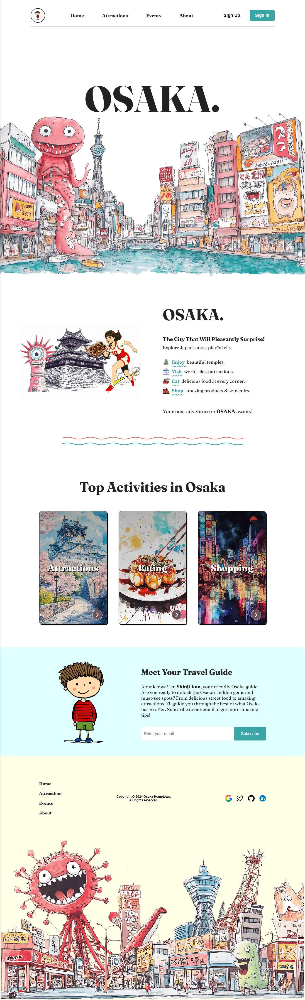

## Hometown Osaka

This is a landing page project that was completed as part of Scrimba's Frontend Developer Path in collaboration with Mozilla Developer to showcase the unique features of our hometown. I am currently based in Osaka so I decided to go a little overboard to showcase what Osaka is about - Fun, crazy and food! Lots of food!

 

I also added a whole lot of custom features beyond the scope of the project, by adding:

1. Mobile responsivenss
2. Custom CSS Animations
3. Sign Up and Sign in Modal
4. Custom generated AI Art to match the theme of the project
5. Interactive cards
6. Custom side navigation bar on small screens

You can view the project live here at:

[Hometown Osaka](https://hometown-osaka.vercel.app/)

 

### Project Status

Live and actively maintained

 

### Project Screen Shots

  

 

### Reflection

<h5>Context:</h5>

 [add content]

<h5>Objective:</h5>

 [add content]

<h5>Challenges:</h5>

 [add content]

 
 

I also spent a significant amount of time trying to ensure the color schemes, font, layout and artwork stayed consistent throughout the page.

 

### Tools and Technologies:

The tech stack and tools were kept to a bare minimum.
 

- JavaScript
- HTML5
- CSS3
- Git (version control)
- Vercel (For Deployment)
